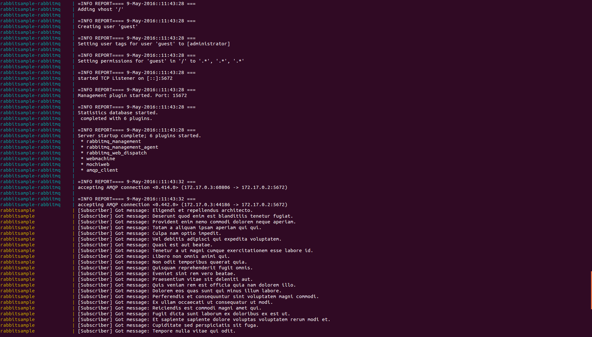

## RabbitMQ Samples

This is a very simple pub/sub sample using RabbitMQ and its .NET client [EasyNetQ](http://easynetq.com/).

### Running the sample

Running the sample requires you to have Docker and Docker Compose installed. That should be all. If you have those, just `cd` into the path where this README file is located and run the below command:

```bash
docker-compose up
```

It will build the docker images and run them according to docker-compose manifest. You should see a similar screen to the below one:

